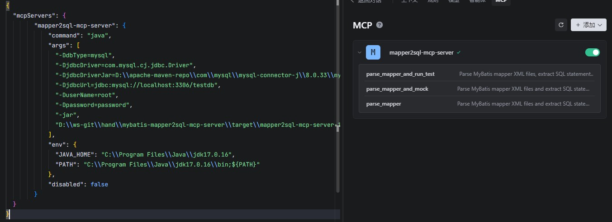
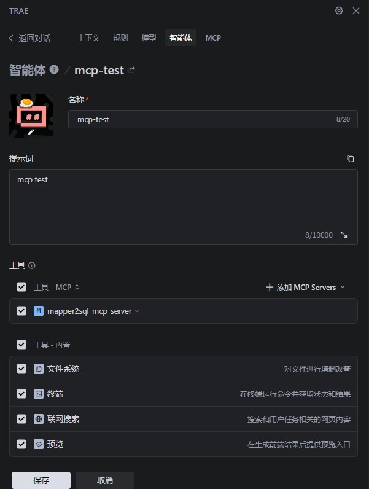
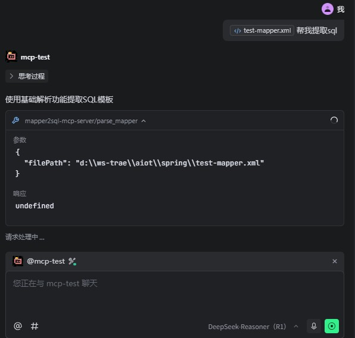

# 本地使用Trae MCP客户端调试说明

本文档介绍如何在本地使用Trae MCP客户端来调试和测试MyBatis Mapper2SQL MCP服务。

## 准备工作

1. 确保已编译并打包项目：
   ```bash
   mvn clean package -DskipTests
   ```

2. 确保生成了可执行的JAR文件：`target/mapper2sql-mcp-server-1.0.0.jar`

## 配置步骤

### 步骤1：添加MCP服务



### 步骤2：创建智能体



### 步骤3：使用智能体对话


